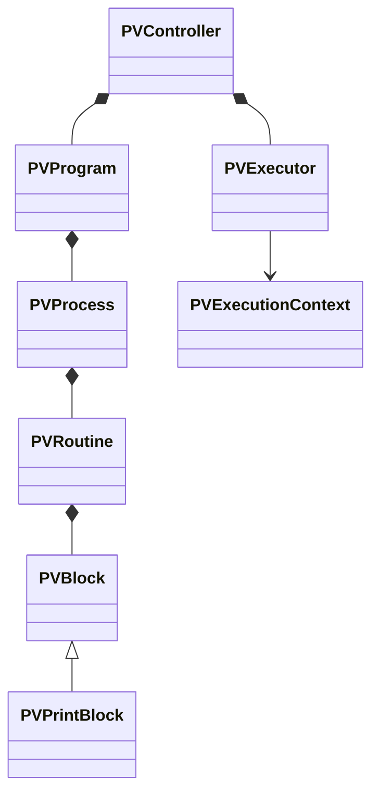

# Arquitectura orientada a objetos de VPFlujo

VPFlujo usará orientación a objetos sin convertir el proyecto en una jerarquía innecesariamente rígida. Se aplicará herencia donde exista una relación “es un tipo de”, y composición cuando un objeto contenga o coordine otros objetos.

## Capas y responsabilidades

| Clase | Base | Responsabilidad |
| --- | --- | --- |
| `plugin.gd` | `EditorPlugin` | Crear y conectar los objetos del complemento. |
| `vp_flujo_dock.gd` | `EditorDock` | Mostrar la interfaz del panel sin buscar nodos ni ejecutar bloques. |
| `pv_scene_inspector.gd` | `RefCounted` | Detectar `PVController` y sus clases derivadas en la escena activa. |
| `PVController` | `Node` | Ser la fachada pública del programa visual dentro de una escena. |
| `PVProgram` | `Resource` | Contener los procesos del programa y permitir su guardado. |
| `PVProcess` | `Resource` | Representar un proceso de Godot, como `_ready` o `_process`. |
| `PVRoutine` | `Resource` | Contener nombre, orden, estado y bloques de una rutina. |
| `PVBlock` | `Resource` | Definir el contrato polimórfico que compartirán todos los bloques. |
| `PVPrintBlock` | `PVBlock` | Implementar la impresión de un texto. |
| `PVExecutor` | `RefCounted` | Recorrer procesos, rutinas y bloques sin depender de la interfaz. |
| `PVExecutionContext` | `RefCounted` | Proporcionar al bloque el controlador, `delta`, evento y datos temporales. |

## Relaciones previstas

## Decisiones principales

- **Encapsulación:** cada clase modifica únicamente su propio estado mediante métodos y señales.
- **Responsabilidad única:** la interfaz, el análisis de escenas, los datos y la ejecución permanecen separados.
- **Polimorfismo:** `PVExecutor` llamará el mismo método de ejecución en cualquier objeto derivado de `PVBlock`.
- **Extensión:** agregar un bloque nuevo consistirá en crear una subclase, sin modificar el ejecutor.
- **Composición:** el programa contendrá procesos; estos contendrán rutinas y cada rutina contendrá bloques.
- **Persistencia:** los elementos del programa heredarán de `Resource`, aprovechando la serialización de Godot y el guardado habitual con `Ctrl+S`.
- **Independencia:** las clases del directorio `runtime` nunca dependerán de las clases del directorio `editor`.

