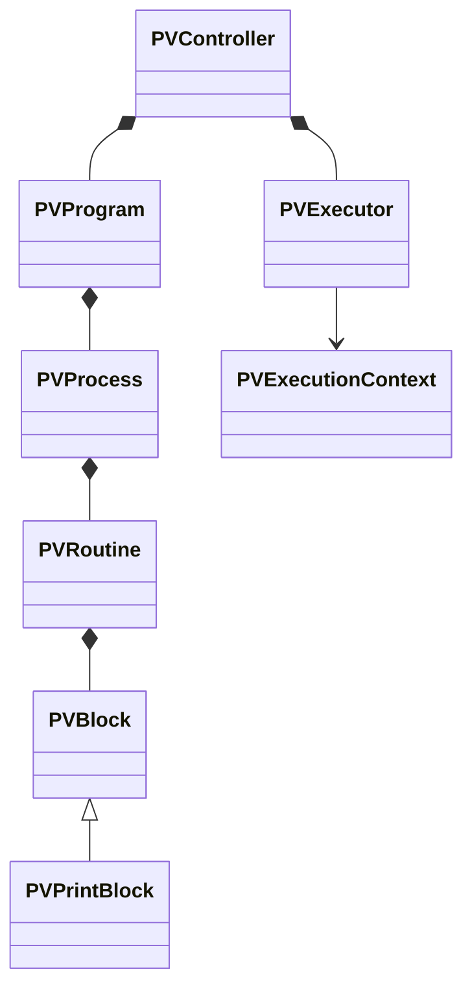

# VPFlujo Object-Oriented Architecture

VPFlujo uses object-oriented design without turning the project into an unnecessarily rigid hierarchy. Inheritance is used where there is an "is a" relationship, and composition is used when one object contains or coordinates others.

## Layers and responsibilities

| Class | Base | Responsibility |
| --- | --- | --- |
| `plugin.gd` | `EditorPlugin` | Create and connect the plugin objects. |
| `vp_flujo_dock.gd` | `EditorDock` | Show the dock interface without finding nodes or executing blocks. |
| `pv_scene_inspector.gd` | `RefCounted` | Detect `PVController` and derived classes in the active scene. |
| `PVController` | `Node` | Serve as the public facade for a visual program within a scene. |
| `PVProgram` | `Resource` | Contain the program processes and allow saving them. |
| `PVProcess` | `Resource` | Represent a Godot process, such as `_ready` or `_process`. |
| `PVRoutine` | `Resource` | Contain a routine name, order, state, and blocks. |
| `PVBlock` | `Resource` | Define the polymorphic contract shared by all blocks. |
| `PVPrintBlock` | `PVBlock` | Implement text printing. |
| `PVExecutor` | `RefCounted` | Traverse processes, routines, and blocks without depending on the interface. |
| `PVExecutionContext` | `RefCounted` | Provide a block with the controller, `delta`, event, and temporary data. |

## Intended relationships

## Main decisions

- **Encapsulation:** each class modifies only its own state through methods and signals.
- **Single responsibility:** the interface, scene analysis, data, and execution remain separate.
- **Polymorphism:** `PVExecutor` will call the same execution method on any object derived from `PVBlock`.
- **Extension:** adding a new block consists of creating a subclass without modifying the executor.
- **Composition:** the program contains processes; processes contain routines; and each routine contains blocks.
- **Persistence:** program elements inherit from `Resource`, using Godot serialization and normal saving with `Ctrl+S`.
- **Independence:** classes in the `runtime` directory never depend on classes in the `editor` directory.
